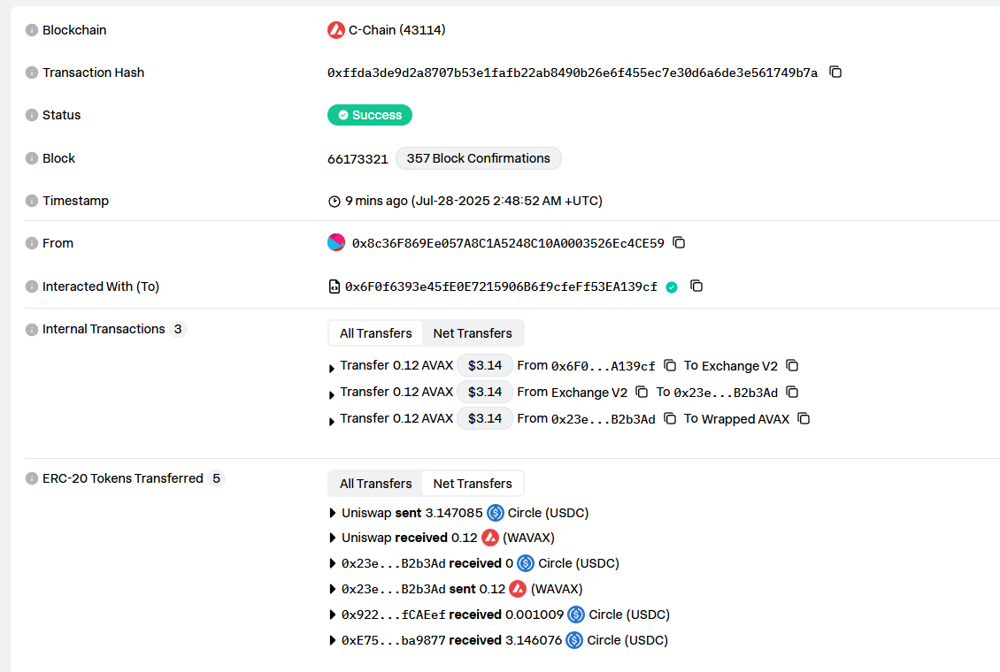
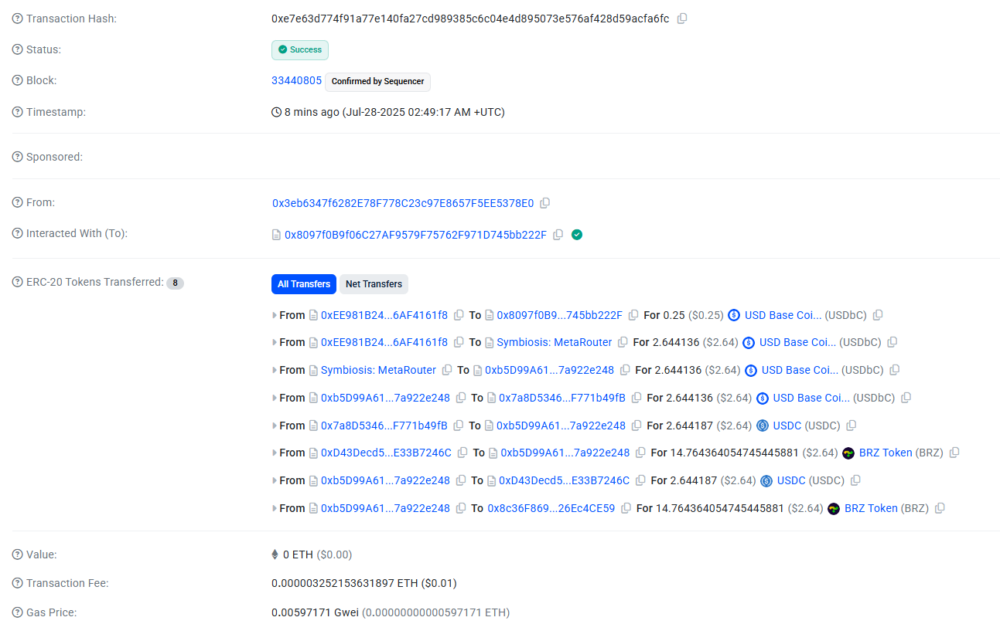

# Payments Hack-a-TON  | Hackathon

# 🍱 Bento Swap

## Solução Cross-Chain para Stablecoins Brasileiras
[Submissão do projeto dorahacks](https://dorahacks.io/buidl/29490)

**Bento Swap** é uma plataforma DeFi que oferece swaps cross-chain otimizados, com foco especial em stablecoins brasileiras como o **BRZ (Brazilian Digital Token)** da [Transfero](https://transfero.com/stablecoins/brz/).

---

## 🎯 Visão Geral

O Bento Swap facilita o acesso e transferência de stablecoins brasileiras entre diferentes blockchains. Nossa solução permite que usuários movam ativos digitais brasileiros de forma eficiente e econômica entre redes como Ethereum, Base, Arbitrum, Polygon e outras, democratizando o acesso ao ecossistema DeFi global.

### 🇧🇷 Foco em Stablecoins Brasileiras

#### **BRZ - Brazilian Digital Token**

- **Emissor**: [Transfero](https://transfero.com/stablecoins/brz/)
- **Paridade**: 1 BRZ = 1 Real Brasileiro (BRL)
- **Regulação**: Totalmente regulamentado no Brasil
- **Suporte**: Múltiplas blockchains (Ethereum, BSC, Polygon)

#### **Benefícios para o Mercado Brasileiro**

- ✅ **Redução de custos** em transferências internacionais
- ✅ **Maior liquidez** para traders brasileiros
- ✅ **Acesso facilitado** ao DeFi global

---

## 🚀 Características Principais

### 🌉 Cross-Chain Bridges

- **Redes Suportadas**: Ethereum, Base, Arbitrum, Polygon, Avalanche, Optimism
- **Protocolos**: Integração com principais bridges do mercado
- **Otimização**: Melhor rota automaticamente selecionada

### 💱 Swap Inteligente

- **Melhor Preço**: Agregação de múltiplas DEXs
- **Baixas Taxas**: Otimização de gas fees
- **Slippage Mínimo**: Proteção contra deslizamento de preço

---

## 🏗️ Arquitetura Técnica

### Stack Principal

```
Frontend: React + TypeScript + Vite
Blockchain: wagmi + viem + ConnectKit
Styling: TailwindCSS + shadcn/ui
APIs: CoinGecko + Custom Bridge API
```

### Componentes Core

#### 🔗 Bridge Integration

```typescript
interface BridgeRoute {
  provider: string;
  fromChain: number;
  toChain: number;
  estimatedTime: number;
  fees: Fee[];
  priceImpact: string;
}
```

#### 💰 Token Management

```typescript
interface Token {
  symbol: string;
  name: string;
  network: string;
  balance: number;
  price: number;
  icon: string;
}
```

#### 📊 Price Oracle

- **CoinGecko Integration**: Preços em tempo real
- **Rate Limiting**: Controle de requisições
- **Cache System**: Otimização de performance

---

## 🌟 Casos de Uso - BRZ

### 1. **Arbitragem Cross-Chain**

```
Usuário detecta diferença de preço do BRZ entre Ethereum e Polygon
↓
Bento Swap encontra melhor rota
↓
Execução automática do swap cross-chain
↓
Lucro capturado com taxas menores
```

### 3. **Remessas Internacionais**

```
Usuário no Brasil compra BRZ
↓
Bridge para rede de menor custo (Base/Arbitrum)
↓
Swap para USDC/USDT
↓
Saque internacional com taxas reduzidas
```

---

## 📈 Roadmap

### Q1 2025 ✅

- [x] Interface principal de swap
- [x] Integração com carteiras Web3
- [x] Suporte para redes principais
- [x] **BRZ Integration**: Suporte nativo para BRZ

### Q2 2025 🚧

- [ ] **Advanced Routing**: Otimização de rotas cross-chain
- [ ] **Gas Optimization**: Redução de custos de transação

### Q3 2025 📋

- [ ] **Yield Farming**: Pools de liquidez BRZ
- [ ] **Governance Token**: Token de governança BENTO
- [ ] **Analytics Dashboard**: Métricas detalhadas
- [ ] **API Pública**: SDK para desenvolvedores

### Q4 2025 🔮

- [ ] **Institutional Features**: Ferramentas para instituições
- [ ] **Fiat On/Off Ramps**: Integração com PIX
- [ ] **Advanced DeFi**: Lending, borrowing, derivatives
- [ ] **DAO Launch**: Governança descentralizada

---

## 🤝 Ecossistema Brasileiro

### Parcerias Estratégicas

- **Transfero**: Integração direta com BRZ
- **Exchanges Nacionais**: Listagem e liquidez
- **Instituições Financeiras**: Adoção empresarial
- **Reguladores**: Compliance e regulamentação

## 💡 Diferencial Competitivo

### 🏆 Vantagens Únicas

1. **Foco no Mercado Brasileiro**: Especialização em stablecoins BRL
2. **Tecnologia Avançada**: Agregação inteligente de liquidez
3. **Experiência Superior**: Interface intuitiva e responsiva
4. **Custos Reduzidos**: Otimização de gas fees e slippage
5. **Suporte Nativo**: Equipe brasileira com conhecimento local

### 📊 Métricas de Performance

- **Slippage Médio**: < 0.5%
- **Tempo de Execução**: < 2min cross-chain
- **Economia de Gas**

---

## 🔮 Visão de Futuro

O **Bento Swap** busca se tornar a **principal porta de entrada** para brasileiros no ecossistema DeFi global, oferecendo:

- 🌍 **Acesso Global**: Conexão do Real Digital com DeFi mundial
- 🏦 **Banking DeFi**: Serviços financeiros descentralizados em BRL
- 🚀 **Inovação Contínua**: Novas funcionalidades baseadas em feedback
- 🤝 **Comunidade Forte**: Educação e adoção em massa

## 📄 Licença

Este projeto está licenciado sob a **MIT License** - veja o arquivo [LICENSE](LICENSE) para detalhes.

---

## 🙏 Agradecimentos

- **Transfero** pelo pioneirismo em stablecoins brasileiras
- **Comunidade DeFi** pelo suporte e feedback
- **Desenvolvedores** que contribuem para o projeto
- **Usuários** que confiam na nossa solução


## Transação Usando Avalanche ---> BRZ Base

Transação Avalanche: [TX_Avalanche](https://snowtrace.io/tx/0xffda3de9d2a8707b53e1fafb22ab8490b26e6f455ec7e30d6a6de3e561749b7a)

Transação na Base: [TX_Base](https://basescan.org/tx/0xe7e63d774f91a77e140fa27cd989385c6c04e4d895073e576af428d59acfa6fc)

---

<div align="center">

**🍱 Bento Swap - Conectando o Brasil ao DeFi Global**

</div>
